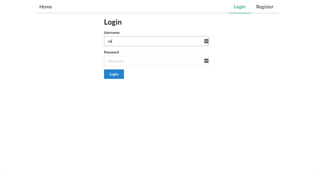

# Reddit Clone (MERNG Stack)

This is my first try using the MERNG (MongoDB, Express, React, NodeJS and GraphQL) Stack for the fullstack web application development.



### Features

1. User Authentication (jsonwebtoken, bcryptjs)
2. Add, Like and Comment Posts

### Issues

- [x] ~~Authorization Token doesnt save to the browser header~~
- [ ] Cannot create Posts on client
- [ ] Cannot Comment on client

## Installation

Use the package manager [yarn](https://yarnpkg.com/) or [npm](https://www.npmjs.com/package/npm) to run yelp clone. use `npm install` instead of `yarn` if you are using node package manager (npm)

```bash
cd client && yarn
cd ..
cd server && yarn
```

## Usage

Run the Server

```bash
cd server
yarn start
```

Run the Client in a different terminal

```bash
cd client
yarn start
```

## Contributing

Pull requests are welcome. For major changes, please open an issue first to discuss what you would like to change.

Please make sure to update and create tests as appropriate.
